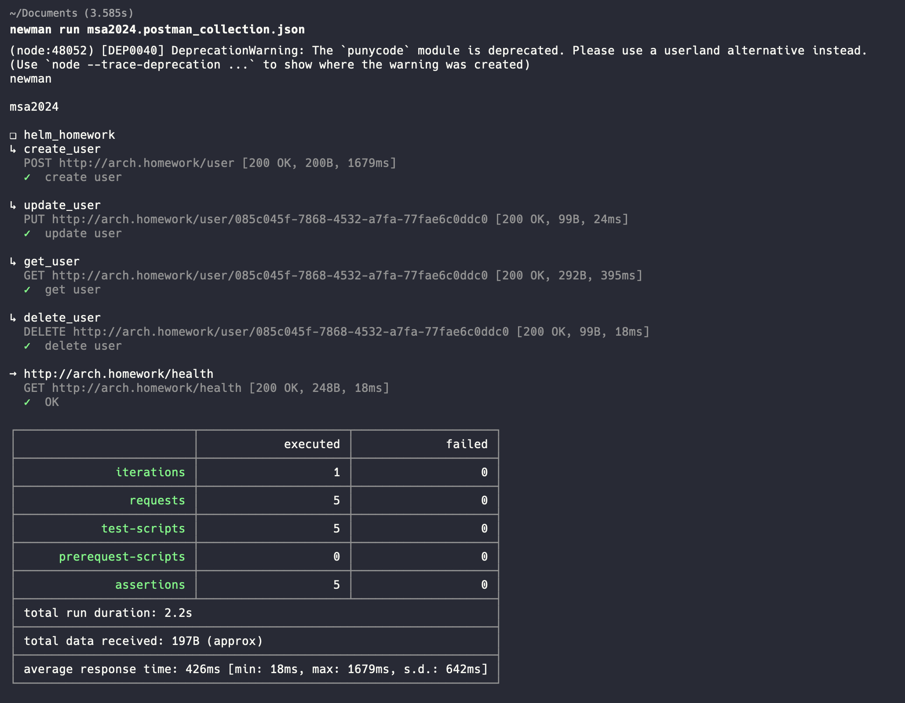

# Microservice Architecture

## ДЗ: Базовые сущности Кubernetes: ReplicaSet, Deployment, Service, Ingress

1. Клонируем репозиторий
    ```shell
    git clone git@github.com:Barsik/otus-msa-2024.git
    ```
2. Переходим в папку `Deploy`
    ```shell
    cd Deploy
    ```
3. Применяем конфигурацию
    ```shell
    kubectl apply -f.
    ```
4. Делаем туннель (в `/etc/hosts` прописать `127.0.0.1	arch.homework`)
    ```shell
    minikube tunnel
    ```
5. Переходим по ссылке http://arch.homework/health/
6. Проверяем тесты Postman https://github.com/Barsik/otus-msa-2024/tree/main/Obavi/Postman
7. Чистим за собой
    ```shell
     kubectl delete -f .
    ```

## ДЗ: Работа с Helm-ом
1. Делаем все аналогично `ДЗ: Базовые сущности Кubernetes: ReplicaSet, Deployment, Service, Ingress` с пункта 1 по 3
2. Устанавливаем PostgreSQL через Helm:
   1. Заходим в папку `/Obavi/Deploy/helm`
   2. Запускаем команду:
        ```bash
        helm install obavi-pgdb bitnami/postgresql --namespace obavi-ns -f ./pg_values.yaml
        ```
3. Делаем доступным наше приложение из minikube
    ```shell
    minikube tunnel
    ```
5. Открываем `swagger` - http://arch.homework/swagger/index.html

> В папке `/Obavi/Postman` находятся Postman-коллекция с тестами
> Результат работы `newman`:

